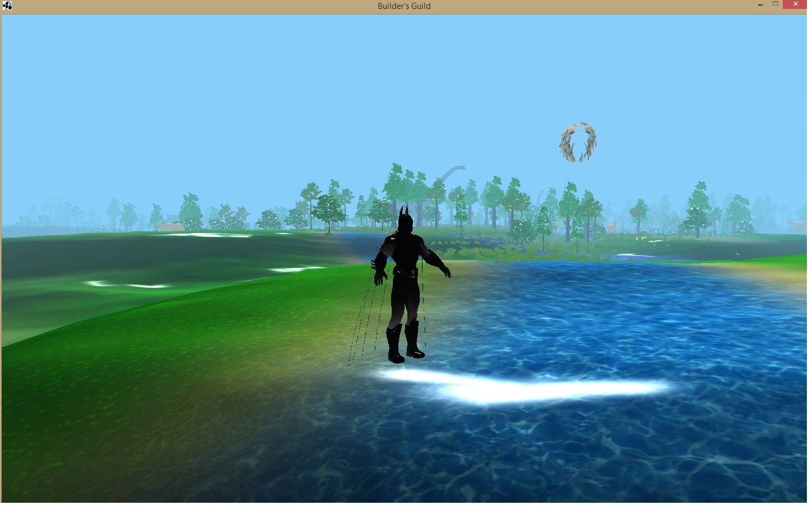
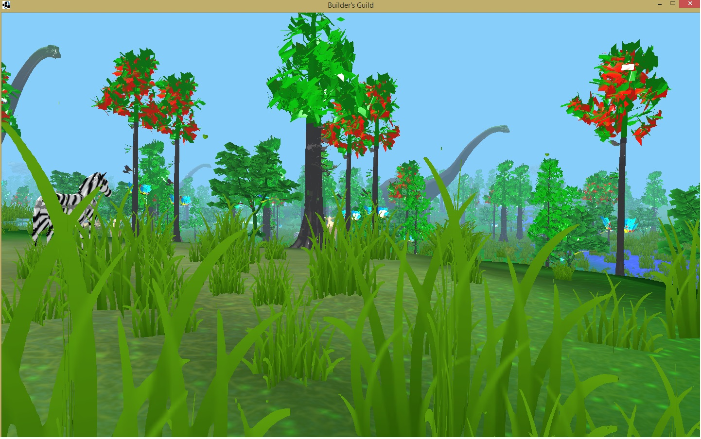
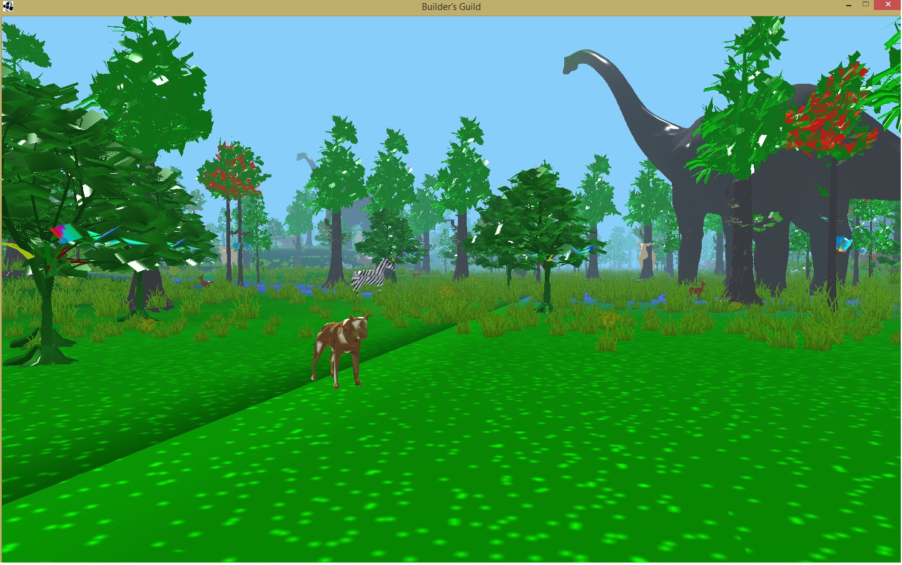
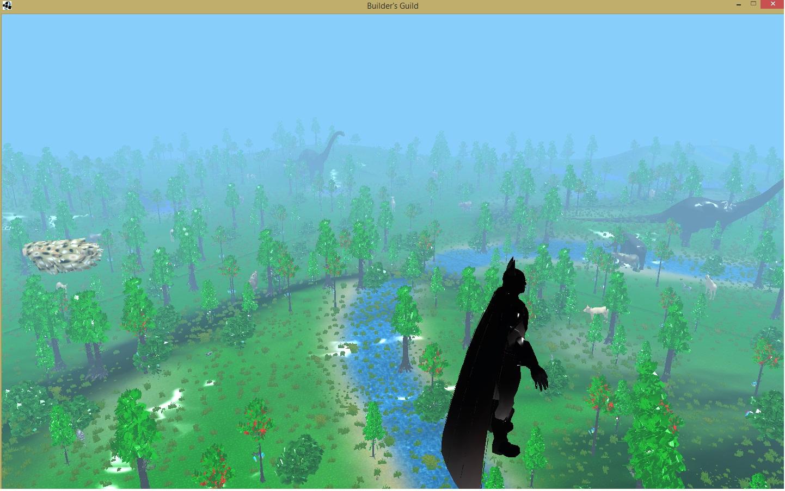

# LWJGLGameEngine
This is a game engine developed in LWJGL library. It is a java library for OpenGL Programming. I used Modern OpenGL and shading languages to complete the game engine. The Game consists of a Open world and a roaming Mode.

- This game contains a Large Terrain, With Chunk Size 4*4, With every chunk sizing 800*800 unit.

- FOG is implemented throughout the game world. The fog illusion was created by changing the color value of vertexes more like the color value of the sky as the object gains distance from the camera.

- This game contains 2 different types of rivers, created with blendmap Texturing technique. which spans throughout the whole terrain.

- The terrain has been given variable height based on Height Map Technique, Where the height of individual vertex of a terrain is calculated using the color value of the pixel of corresponding greyscale heightMap picture.

- Here I have implemented Diffuse Lighting, Specular Lighting and Ambient Lighting with the light source at co-ordinate 20000,40000, 10000. All in OpenGL Shading Language.

- In this forest There are about several hundreds animal of  13 types of species. All of the animals have individual direction of motion, turn duration and velocity of motion. All of these are assigned randomly in the run-time with specific thresholds for each type of animals.

- All of the 3d Models were obtained from tf3dm.com. And all of those were UV Mapped by me. All the 3D models had to be optimized By hand - the edge and face counts had to be reduced to run efficiently in the Game. The decimate plugin of Blender helped me a lot in optimizing more.

The game was developed using the Modern OpenGL. Which is very much dependent on shading language. I had to learn the OpenGL Shading Language to complete the game in Modern OpenGL. The fact that I used Java as my preferred language changes very little about how the game was developed in Modern OpenGL and GLSL. Mostly the fact that the LWJGL library includes OpenGL ES Binding, Objective-c binding, GLFW and even OpenCL Binding contributed in my choice. I liked the way this library feels compact and reliable.

